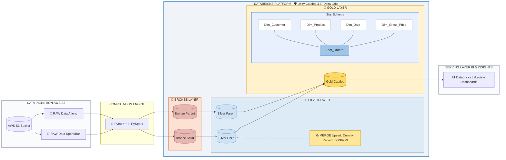
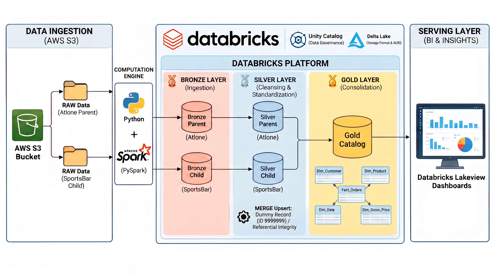

# 🚀 Atlone Enterprise: Data Consolidation Pipeline

## 📊 Resumen Ejecutivo
Este proyecto es una solución integral de Ingeniería de Datos diseñada para resolver un problema clásico de fusiones y adquisiciones corporativas: la **consolidación de datos**. 

El objetivo principal fue unificar las ventas y métricas operativas de la empresa matriz (**Atlone Enterprise**) con su nueva subsidiaria (**SportsBar**), integrando dos fuentes de datos dispares en una única fuente de la verdad (Single Source of Truth) para la toma de decisiones gerenciales, asegurando la integridad referencial y automatizando la actualización de tableros de Business Intelligence.

---

## 🏗️ Arquitectura de Datos (Medallion Architecture)

El pipeline fue construido utilizando el estándar de la industria **Medallion Architecture** dentro del ecosistema de Databricks, garantizando escalabilidad y calidad de datos.

### Estructura del Catálogo (Unity Catalog)
Los datos se organizaron de forma lógica y segura utilizando catálogos y esquemas separados:
*   🥉 **Capa Bronze (`bronze_parent` / `bronze_child`):** Datos crudos y sin procesar, manteniendo la inmutabilidad histórica.
*   🥈 **Capa Silver (`silver_parent` / `silver_child`):** Datos limpios, filtrados y estandarizados. Aquí se manejó la imputación de valores nulos y la corrección de anomalías en los IDs de clientes (generación de *Dummy Records*).
*   🥇 **Capa Gold (`gold`):** Modelo dimensional consolidado (Star Schema) listo para el consumo de BI.

---

## ⚙️ Orquestación y Flujo del Pipeline (Data Flow)

Para optimizar los tiempos de cómputo y los costos en la nube, el flujo de trabajo fue diseñado con **procesamiento paralelo** para las dimensiones independientes, convergiendo en nodos secuenciales para las tablas de hechos y la consolidación final.

*   **Fase 1 (Extracción y Limpieza Paralela):** Procesamiento simultáneo de clientes, productos y precios tanto para la empresa matriz como para la subsidiaria.
*   **Fase 2 (Validación de Hechos):** Carga incremental de las órdenes de venta (`fact_orders`) asegurando que las dimensiones maestras ya estén disponibles.
*   **Fase 3 (Consolidación Gold):** Unificación de ambas empresas mediante operaciones `MERGE` (Upserts) en tablas Delta, evitando duplicidades.
*   **Fase 4 (BI Automático):** Tarea final automatizada para refrescar el Dashboard (`9_refresh_dashboard`) solo cuando los datos superaron todas las validaciones.

---

## 🔗 Modelado de Datos y Linaje (Data Lineage)

El modelo de datos final expuesto a la capa de negocios es un **Modelo en Estrella (Star Schema)** compuesto por tres dimensiones consolidadas (`dim_customers`, `dim_products`, `dim_gross_price`) y una tabla de hechos central (`4_fact_orders`).

Se implementó un rastreo estricto de linaje de datos para garantizar la observabilidad y permitir auditorías rápidas sobre el origen de cualquier métrica.

### 🛠️ Desafío Técnico Destacado: Integridad Referencial
Durante la ingesta, la subsidiaria presentaba ventas con IDs de clientes nulos o inválidos. Para evitar la pérdida de facturación en el cálculo del *Total Revenue* del Dashboard, se implementó la inyección automatizada de un **Registro Ficticio (Dummy Record: 999999)** en la capa Silver. Esto garantizó una relación perfecta de 1 a N (Modelo Estrella) sin valores huérfanos, etiquetando los errores para visibilidad del equipo de calidad de datos.

---

## 🛡️ Observabilidad y Delta Lake (Time Travel)

Todas las tablas fueron creadas bajo el formato **Delta Lake**, aprovechando el registro de transacciones (Transaction Log). Esto permite:
*   Transacciones ACID confiables.
*   Control de versiones de los datos (*Time Travel*).
*   Monitoreo de operaciones `MERGE` y `CREATE OR REPLACE TABLE`.

---

## 📈 Business Intelligence & Resultados

El pipeline culmina en un panel de control automatizado que permite a los *stakeholders* filtrar la información a nivel global (Consolidado) o realizar *drill-down* por empresa origen (Atlone vs. SportsBar). 

**Métricas Clave (KPIs) Analizadas:**
*   Ingresos Totales (Total Revenue).
*   Unidades Vendidas.
*   Clientes Únicos.
*   Distribución de ingresos por canal y tendencia mensual.

> [📥 Haz clic aquí para ver el Dashboard completo con todos los KPIs en formato PDF](3_dashboards/atlone_enterprise.pdf)

---
## 🛠️ Tecnologías y Herramientas Utilizadas

El pipeline fue diseñado e implementado utilizando un *stack* moderno de ingeniería de datos, enfocado en el rendimiento computacional, transacciones ACID y un estricto gobierno de la información:

* **Lenguajes & Frameworks:** `Python` | `Apache Spark (PySpark)` | `SQL`
* **Infraestructura & Plataforma:** `Databricks Data Intelligence Platform` | `AWS S3` (Ingesta Raw)
* **Arquitectura & Almacenamiento:** `Medallion Architecture` (Bronze, Silver, Gold) | `Delta Lake`
* **Gobierno de Datos & Orquestación:** `Unity Catalog` | `Databricks Workflows`
* **Técnicas de Ingeniería:** Procesamiento en Paralelo | `MERGE` Upserts | Integridad Referencial (Dummy Records)
* **Modelado & Visualización:** `Data Modeling (Star Schema)` | `Databricks Lakeview Dashboards`
